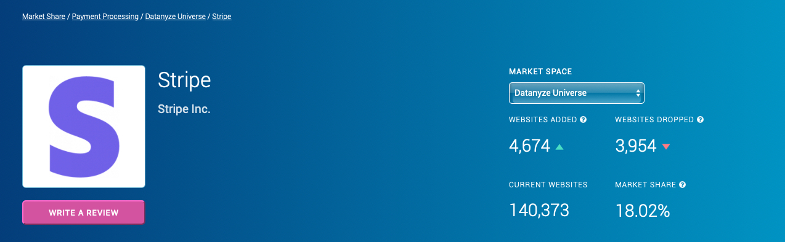

# Unit1Homework Stripe Case Study

*Hello this is Milad Nazar. I am working on my first Homework here and I want to study FinTech so I can build a solution or substitution for Billing/Payments.*

## Overview and Origin

* Stripe is a technology company that builds economic infrastructure for the internet. Businesses of every size—from new startups to public companies—use this software to accept payments and manage their businesses online.
* **When was the company incorporated?**
This company is founded in 2010. Stripe is headquartered in San Francisco, with offices in Dublin, London, Paris, Singapore, Tokyo, and more.
* **Who are the founders of the company?**
Patrick Collison, and John Collison are two Brothers who began Stripe. 
* **How did the idea for the company (or project) come about?**
Businesses didn't have any large scale online payment solutions so Stipe came up with solution for payments between businesses. Eventhough PayPal was available but PayPal was famous for payments between people not so much businesses. 
* **How is the company funded? How much funding have they received?**
In May 2011, Stripe received a $2 million investment from venture capitalists Peter Thiel, Sequoia Capital, and Andreessen Horowitz. Stripe launched publicly in September 2011 after an extensive private beta.

## Business Activities:
**What specific financial problem is the company or project trying to solve?**
By building better payments infrastructure, Stripe want to enable more businesses and transactions. Stripe aim is to expand the internet economy — simply replacing the legacy payment providers would probably be a great business success.
On the product front, Stripe's primary challenge is redesigning online payments (and the associated tooling) from the ground up. 
* **Who is the company's intended customer?  Is there any information about the market size of this set of customers?**
Stripe's customers ranges from startups to the world’s largest companies like Google, Amazon, Microsoft
Millions of companies in over 120 countries use Stripe to start, run, and scale their businesses.

**What solution does this company offer that their competitors do not or cannot offer? (What is the unfair advantage they utilize?)**

PayPal is one of their competitors who accepts payments from users in over 200 countries. Stripe only accepts payments from users in 25 countries. PayPal can only process 25 currencies whereas Stripe has an advantage of processes over 135 currencies.

*Currently, PayPal accepts payments through the following methods:*

1. PayPal
2. PayPal Credit
3. Credit cards
4. Debit cards
5. Pay by phone

*If that restriction in payment types worries you, then you may prefer using Stripe that accepts a vast array of payment types, including:*

1. Credit cards
2. Debit cards
3. International cards
4. AmEx Checkout
5. Masterpass by MasterCard
6. Visa Checkout
7. WeChat Pay
8. AliPay
9. Apple Pay
10. Google Pay
11. ACH credit and debit
12. SEPA direct debit

If you’re just in need of a simple payment processing solution, PayPal’s minimal integrations might be all that you need. Specifically, PayPal integrates with platforms like WooCommerce, QuickBooks, and Salesforce. E-commerce, accounting, and CRM–that’s really all some businesses may need.

*Stripe, however, goes way above and beyond in terms of its integrations. It has entire categories dedicated to:*
1. CRM
2. Customer Support
3. eCommerce
4. Email Marketing
5. Form Building
6. Fundraising
7. Inventory Management
8. Recurring Payments
9. Referral Marketing

**Which technologies are they currently using, and how are they implementing them? (This may take a little bit of sleuthing–– you may want to search the company's engineering blog or use sites like Stackshare to find this information.)**

* Here’s a quick overview of some interesting software products Stripe is using internally:

- Marketing: AdRoll, Drip, Mandrill, Owler
- Sales and Support: Clearbit, LeadGenius, DueDil, Zendesk
- Developer and IT: CircleCI, Cloudera, NGINX, PagerDuty
- Analytics: Google Analytics, Mixpanel
- HR: Culture Amp, Greenhouse, Hired, MOVE Guides
- Finance: Abacus, Baremetrics, MasterCard API
- Productivity: Asana, Dropbox, Slack, EventBoard

## Landscape:

* **What domain of the financial industry is the company in?**

Stripe is in Billing/Payments domain.

* **What have been the major trends and innovations of this domain over the last 5-10 years?**

It took 9,500 years to reach paper money, and in less than 60 years we have made an unprecedented leap in its evolution, achieving nearly invisible payment.
From gold coins to digital wallets, the payments industry has always evolved. But the reality is that to get to this point, where we have a wide range of payment options, we have gone through a great process of evolution and transformation, as well as an adaptation on the part of the consumer.

*The most famous method of payment for the past 50-10 years is called Pay by Link*

When we talk about Pay By Link we are referring to a method of payment that greatly simplifies the sending and receipt of an economic amount to pay a service or for the purchase of a product.
As its name suggests, it consists of sharing a link through the social network that best suits your needs – whether Facebook, Skype, Twitter, Instagram, mail or WhatsApp among others – and is valid for any model of mobile phone -Android or iPhone-. You can send it by email or include the link in the same budget or invoice.

Luckily for everyone, Pay By Link is not a method that is limited to any specific case, in fact, it is quite the opposite. There are many freelancers who use it to educate their clients in the simplest way possible. This is to facilitate the payment process to avoid delays and other unnecessary problems. It is also used by those companies that are based on their social networks, such as Facebook or Instagram, as they do not have any physical store or any online store.

**What are the other major companies in this domain?**

*Top Stripe Competitors*

- Square
- PayPal
- Adyen
- 2Checkout
- WePay
- Authorize.Net
- Braintree
- Payline Data
- PayJunction
- Fattmerchant

### Results
* **What has been the business impact of this company so far?**

Stripe has helped increase the GDP of the internet. Stripe builds financial tools and economic infrastructure for the internet. They’re helping small startups and the world’s biggest companies build products, create business models, and scale their efforts globally. For example, UBER & LYFT can concentrate on delighting drivers and riders, rather than moving money between them. 

* **What are some of the core metrics that companies in this domain use to measure success? How is your company performing, based on these metrics?**

Stripe's GROWTH DEPENDS ON their USERS’ GROWTH. Only outrunning their competitors would be insufficient—they have to outrun all their customers. Stripe's goal is to support modes of commerce that don’t yet exist because they are still busy inventing them. They measure success by remaining a step ahead of the millions of organizations that use Stripe every day so they can help them scale and succeed for their success.

More than 2,500 Stripes build products and support their users from offices in San Francisco, Chicago, New York City, Seattle, Amsterdam, Bangalore, Berlin, Dublin, London, Paris, Melbourne, Singapore, Mexico City, and Tokyo—as well as the homes and coworking spaces of their remote colleagues.

* **How is your company performing relative to competitors in the same domain?**

*Stripe is ranked #2 put of 283 Payment Processing technologies in Datanyze Universe* 

Below is the market share of top 5 stripe's competitors out of 283 companies.

   | Top Competitors | Websites | Market Share | Versus Page       |
   | --- | --- | --- | --- |
   | PayPal          | 431,459  | 55.40%       | Stripe vs. PayPal |
   | Amazon Pay      | 29,072   | 3.73%        | Stripe vs. Amazon Pay |
   | Braintree       | 17,230   | 2.21%        | Stripe vs. Braintree |
   | Square Payments | 17,042   | 2.19%        | Stripe vs. Square Payments |

## Recommendations

* **If you were to advise the company, what products or services would you suggest they offer? (This could be something that a competitor offers, or use your imagination!)**

* I would suggest for Stripe to enable instant transfers. Right now they're doing transfers in 2 days and that's their only option. 
* I would suggest for Stripe to provide full access of their services like billing and Invoicing for their consumers. Right now their Billing/Invoicing option is disabled and you will have to purchase it to use it. I would understand this concept if it was a downloadable software or application but Stripe is a website and these options should be already enabled or built in. 

* **Why do you think that offering this product or service would benefit the company?**

The more options a website has for their consumers to use then it will be used by the consumer automaticaly. I personally use both Stripe and PayPal on a daily bases at work. Without a doubt I would say that PayPal is easier to use than Stripe and funds are more accessible. 

* **What technologies would this additional product or service utilize?**

* Why are these technologies appropriate for your solution?

## References

[Stripe Impact on Economy](https://stripe.com/jobs)

[10 Best Stripe Competitors for Small Businesses](https://www.fundera.com/blog/stripe-competitors)

[Interview with the C.E.O. Running Your Company by Patrick Collison](https://www.youtube.com/watch?v=NprBQi0cSHU)

[Technologies Being Used by Stripe](https://stackshare.io/stripe)

[Stripe Market Share](https://www.datanyze.com/market-share/payment-processing--26/Datanyze%20Universe/stripe)
