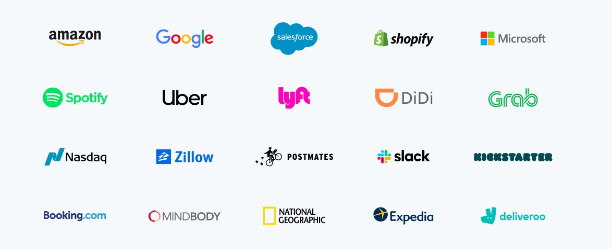
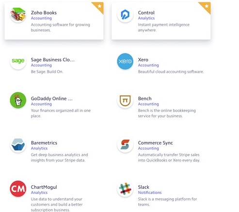

# Unit1Homework
Unit 1 Homework Assignment: FinTech Case Study
Hello this is Milad Nazar. I am an working on my first Homework here and I want to study FinTech so I can build a solution or substittue for Billing/Payments. 
## Overview and Origin
* Stripe
Stripe is a technology company that builds economic infrastructure for the internet. Businesses of every size—from new startups to public companies—use our software to accept payments and manage their businesses online.
* When was the company incorporated?
This company is founded in 2010. Stripe is headquartered in San Francisco, with offices in Dublin, London, Paris, Singapore, Tokyo, and more.
* Who are the founders of the company?
Patrick Collison, and John Collison (Brothers)
* How did the idea for the company (or project) come about?
Businesses didn't have any large scale online payment solutions so Stipe came up with solution for payments between businesses. Eventhough PayPal was available but PayPal was famous for payments between people not so much businesses. 
* How is the company funded? How much funding have they received?
In May 2011, Stripe received a $2 million investment from venture capitalists Peter Thiel, Sequoia Capital, and Andreessen Horowitz. Stripe launched publicly in September 2011 after an extensive private beta.
## Business Activities:
* What specific financial problem is the company or project trying to solve?
By building better payments infrastructure, Stripe want to enable more businesses and transactions. Stripe aim is to expand the internet economy — simply replacing the legacy payment providers would probably be a great business success.
On the product front, Stripe's primary challenge is redesigning online payments (and the associated tooling) from the ground up. 
* Who is the company's intended customer?  Is there any information about the market size of this set of customers?
From startups to the world’s largest companies like Google, Amazon, Microsoft
Millions of companies in over 120 countries use Stripe to start, run, and scale their businesses.

* What solution does this company offer that their competitors do not or cannot offer? (What is the unfair advantage they utilize?)

PayPal is one of their competitors who accepts payments from users in over 200 countries. Stripe only accepts payments from users in 25 countries. PayPal can only process 25 currencies whereas Stripe has an advantage of processes over 135 currencies.

Currently, PayPal accepts payments through the following methods:

1. PayPal
2. PayPal Credit
3. Credit cards
4. Debit cards
5. Pay by phone
Some payment types are only available based on the pricing tier chosen, so pay close attention to that before signing up. For instance, you can only get pay-by-phone virtual terminal payments with the Payments Pro plan.

If that restriction in payment types worries you, then you may prefer using Stripe that accepts a vast array of payment types, including:

1. Credit cards
2. Debit cards
3. International cards
4. AmEx Checkout
5. Masterpass by MasterCard
6. Visa Checkout
7. WeChat Pay
8. AliPay
9. Apple Pay
10. Google Pay
11. ACH credit and debit
12. SEPA direct debit

If you’re just in need of a simple payment processing solution, PayPal’s minimal integrations might be all that you need. Specifically, PayPal integrates with platforms like WooCommerce, QuickBooks, and Salesforce. E-commerce, accounting, and CRM–that’s really all some businesses may need.

Stripe, however, goes way above and beyond in terms of its integrations. It has entire categories dedicated to:

1. CRM
2. Customer Support
3. eCommerce
4. Email Marketing
5. Form Building
6. Fundraising
7. Inventory Management
8. Recurring Payments
9. Referral Marketing

* Which technologies are they currently using, and how are they implementing them? (This may take a little bit of sleuthing–– you may want to search the company's engineering blog or use sites like Stackshare to find this information.)